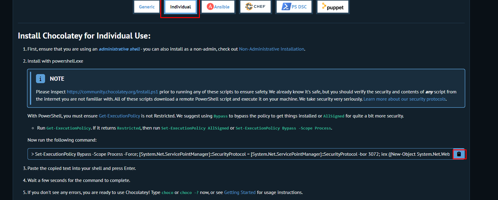
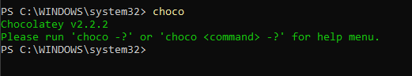
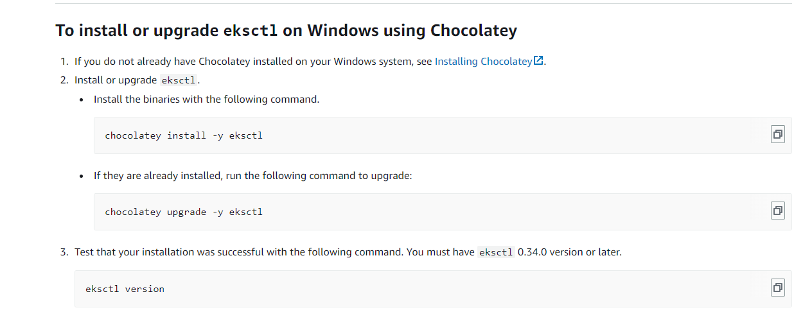
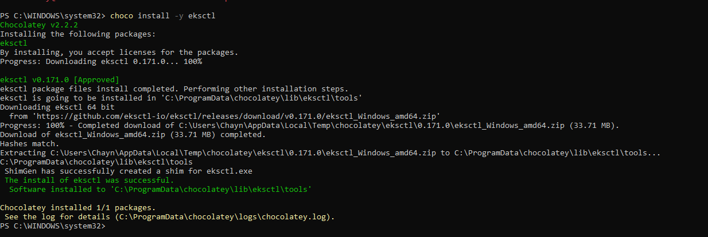
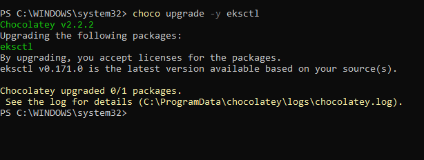
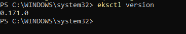

# Installation of Eksctl in Windows

https://docs.aws.amazon.com/emr/latest/EMR-on-EKS-DevelopmentGuide/setting-up-eksctl.html

1) Firstly we have to install chocolatey

```
https://chocolatey.org/install#individual

```



After Installing Chocolately through poweshelll in windows cross check it 

```
choco
```



2) Installing Eksctl

https://docs.aws.amazon.com/emr/latest/EMR-on-EKS-DevelopmentGuide/setting-up-eksctl.html



```
chocolatey install -y eksctl
```



```
chocolatey upgrade -y eksctl
```



3) Check the ekctl vresion

```
eksctl version
```

